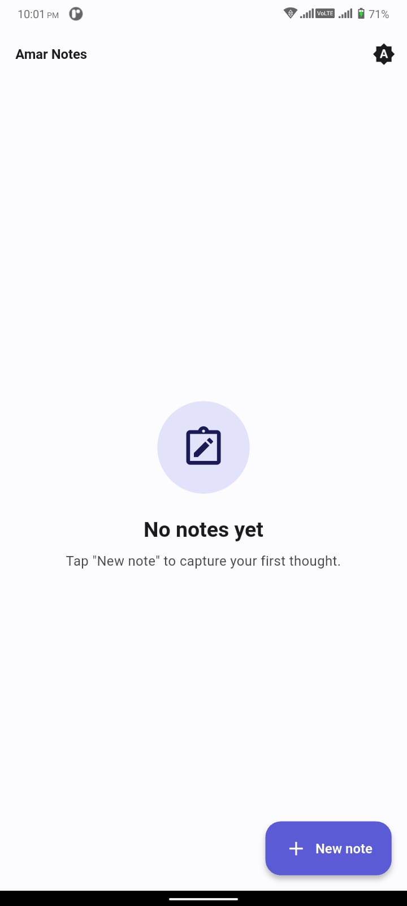
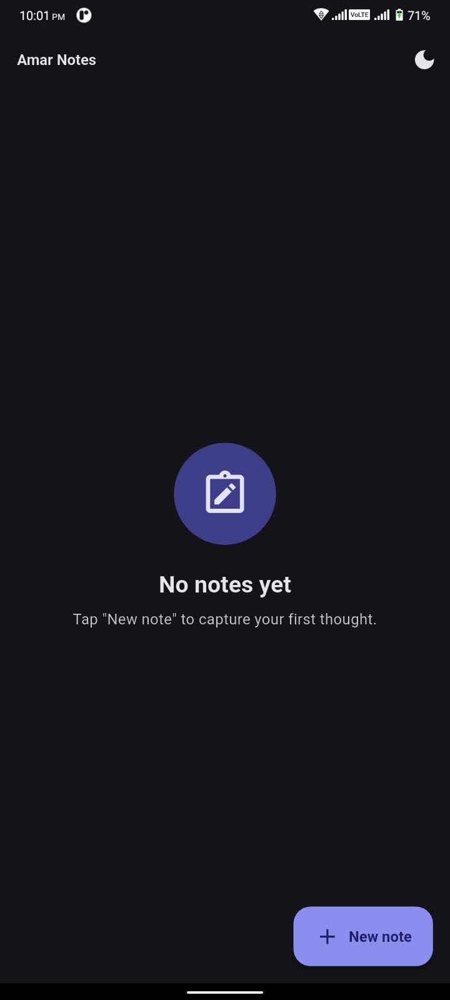
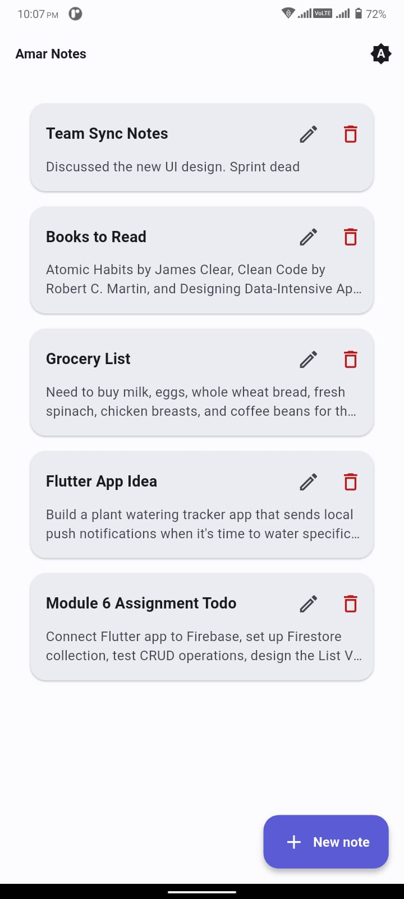
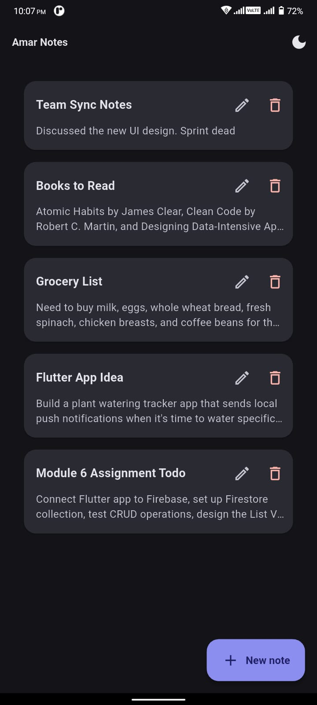
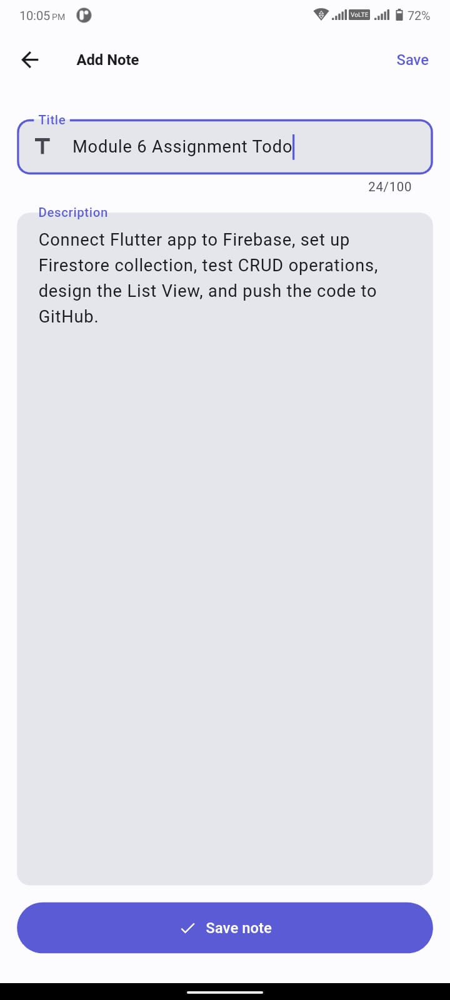
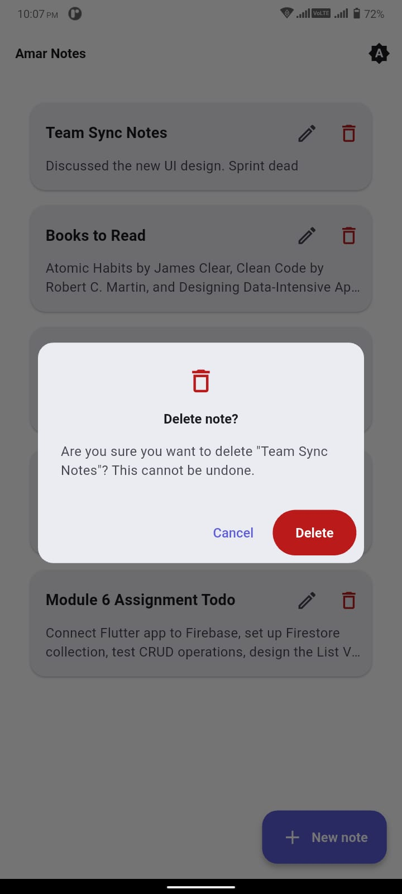
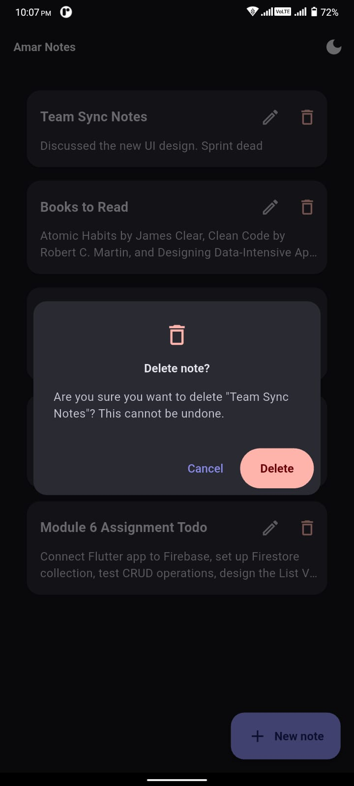

<div align="center">

# 📝 Amar Notes

### A clean, real-time notes app built with Flutter & Cloud Firestore

*Assignment — Module 6, Ostad | Notes Management Application*

[](https://flutter.dev)
[](https://firebase.google.com)
[](https://m3.material.io)
[](#license)

</div>

---

## 📖 Overview

**Amar Notes** is a small but polished Flutter notes-management app backed by **Cloud Firestore**. It was built to satisfy the Module 6 assignment requirements — full CRUD on notes — while going a step further with clean architecture, hand-built **Material 3** theming, and fully **reactive** UI updates, all without leaning on heavyweight state-management libraries.

> No Bloc. No Riverpod. No GetX. Just `StreamBuilder` and `setState`, used correctly.

---

## 📸 Screenshots

<p align="center"><i>Every screen, side by side in Light and Dark mode.</i></p>

### 🏠 Notes List — Empty State

<table>
<tr>
<th align="center">☀️ Light Mode</th>
<th align="center">🌙 Dark Mode</th>
</tr>
<tr>
<td></td>
<td></td>
</tr>
</table>

### 📋 Notes List — With Notes

<table>
<tr>
<th align="center">☀️ Light Mode</th>
<th align="center">🌙 Dark Mode</th>
</tr>
<tr>
<td></td>
<td></td>
</tr>
</table>

### ➕ Add / Edit Note

<table>
<tr>
<th align="center">☀️ Light Mode</th>
<th align="center">🌙 Dark Mode</th>
</tr>
<tr>
<td></td>
<td></td>
</tr>
</table>

### 🗑️ Delete Confirmation Dialog

<table>
<tr>
<th align="center">☀️ Light Mode</th>
<th align="center">🌙 Dark Mode</th>
</tr>
<tr>
<td></td>
<td></td>
</tr>
</table>

> 💡 **Tip for setup:** create a `screenshots/light/` and `screenshots/dark/` folder in the repo root and drop in the matching PNgs with the exact filenames above — the images will render automatically on GitHub.

---

## ✨ Features

|     | Feature                    | Details                                                                                                                      |
|-----|----------------------------|------------------------------------------------------------------------------------------------------------------------------|
| ✅   | **Create**                 | Add a note with a title and description, validated inline                                                                    |
| 👀  | **Real-time list**         | Home screen updates instantly on add / edit / delete — even from another device — via a Firestore `Stream` + `StreamBuilder` |
| ✏️  | **Update**                 | Edit any existing note through the same form used to create one                                                              |
| 🗑️ | **Delete**                 | Remove a note, guarded by a confirmation dialog                                                                              |
| 🎨  | **Theming**                | Hand-built Light, Dark, and System Material 3 themes — switchable right from the AppBar                                      |
| 📱  | **Responsive**             | Layout adapts cleanly across phones, tablets, and wider screens                                                              |
| 🧼  | **Zero hardcoded styling** | Every color, text style, and radius is pulled from a central design-token system                                             |

---

## 🏗️ Tech Stack

| Layer                | Choice                                       |
|----------------------|----------------------------------------------|
| **Framework**        | Flutter (Material 3)                         |
| **Backend**          | Firebase Cloud Firestore                     |
| **Auth**             | *Not used — see [Security](#-security-note)* |
| **State Management** | `setState` + `StreamBuilder`                 |
| **Theming**          | Hand-built `ColorScheme` + Material 3        |

---

## 📂 Project Structure

```
lib/
├── main.dart                          # App entry; Firebase init + theme state
├── firebase_options.dart              # Platform config (generated)
│
├── models/
│   └── note.dart                      # Note data class + Firestore (de)serialization
│
├── services/
│   └── firestore_service.dart         # All Firestore CRUD (add / read / update / delete / stream)
│
├── screens/
│   ├── notes_list_screen.dart         # Home: real-time list + FAB + theme toggle
│   └── note_edit_screen.dart          # Add / Edit form (single screen, dual mode)
│
├── widgets/
│   ├── note_card.dart                 # Reusable card for one note
│   ├── empty_state.dart               # Reusable empty-state widget
│   ├── delete_confirmation_dialog.dart# showDeleteNoteDialog()
│   └── responsive.dart                # horizontalScreenPadding() helper
│
└── theme/                             # Design-token system (no widgets)
    ├── app_theme.dart                 # Barrel: lightTheme, darkTheme, tokens
    ├── app_colors.dart                # Brand + hand-tuned lightScheme & darkScheme
    ├── app_spacing.dart               # 4-pt scale + responsive helper
    ├── app_radius.dart                # sm / md / lg / xl / pill
    ├── app_text_theme.dart            # Material 3 TextTheme for both modes
    ├── light_theme.dart               # ThemeData(light) — built from scratch
    └── dark_theme.dart                # ThemeData(dark)  — built from scratch
```

### 🧠 Architecture Notes

- **Layered by purpose** (model → service → screen → widget), not by feature — the right call for a CRUD app of this size.
- **`FirestoreService` is a static facade** — no DI container, no repository pattern. Screens call it directly. Simple, debuggable, and easy to extend.
- **No Bloc, Riverpod, or GetX.** `StreamBuilder` plus `setState` carries all UI state — right-sized for the problem, not over-engineered.
- **One screen for add and edit** (`NoteEditScreen`) — the optional `note` argument decides the mode, eliminating duplication.

---

## 🔥 Firestore Data Model

Each note is a document in the top-level `notes` collection:

```jsonc
{
  "title":       "Buy groceries",
  "description": "Milk, eggs, bread",
  "createdAt":   <Firestore Timestamp>,
  "updatedAt":   <Firestore Timestamp>
}
```

The document ID is the Firestore-generated UID; it is **not** stored as a field. Timestamps use `FieldValue.serverTimestamp()` to avoid client-clock skew when sorting by `updatedAt`.

---

## 🚀 Getting Started

### 1. Prerequisites

- Flutter SDK `^3.11.5`
- A Firebase project (free **Spark** tier is enough)
- Firebase CLI and FlutterFire CLI

### 2. Install the Firebase tooling (one-time)

```bash
# Firebase CLI (Node.js required)
npm install -g firebase-tools

# FlutterFire CLI
dart pub global activate flutterfire_cli
```

### 3. Sign in to Firebase

```bash
firebase login
```

### 4. Configure the project

From the project root:

```bash
flutterfire configure
```

This will:

1. Ask you to **select or create** a Firebase project.
2. Ask which **platforms** to enable (Android is the focus; iOS / web are optional).
3. Auto-register the Android app and **download `google-services.json`** into `android/app/`.
4. **Patch the Android Gradle files** to apply the Google Services plugin.
5. **Generate `lib/firebase_options.dart`** with your real keys.

> ℹ️ `lib/firebase_options.dart` and `android/app/google-services.json` are **gitignored** because they contain API keys. They're regenerated locally by `flutterfire configure` — never commit them.

### 5. Run

```bash
flutter pub get
flutter run
```

> 💡 If you skip step 4, the app will fail at startup with an invalid API key error — that's expected. The placeholder `firebase_options.dart` cannot talk to a real Firestore project.

---

## ✅ Verification

```bash
flutter analyze        # static analysis
flutter test           # theme smoke tests
```

---

## 🔒 Security Note

Authentication is intentionally **not implemented** — it's outside the scope of this assignment, which focuses on CRUD operations against Firestore. In a production app, Firestore Security Rules and user authentication would be added to scope notes per-user.

---

## 🎯 Assignment Checklist

| Requirement                          | Status |
|--------------------------------------|:------:|
| Create note (title + description)    |   ✅    |
| View all notes in a list             |   ✅    |
| Update an existing note              |   ✅    |
| Delete a note                        |   ✅    |
| Notes List Screen                    |   ✅    |
| Add / Edit Note Screen               |   ✅    |
| Built with Flutter + Cloud Firestore |   ✅    |

---

## 📄 License

This is a student project, provided as-is for educational use.

<div align="center">

Made with 💙 and Flutter

</div>